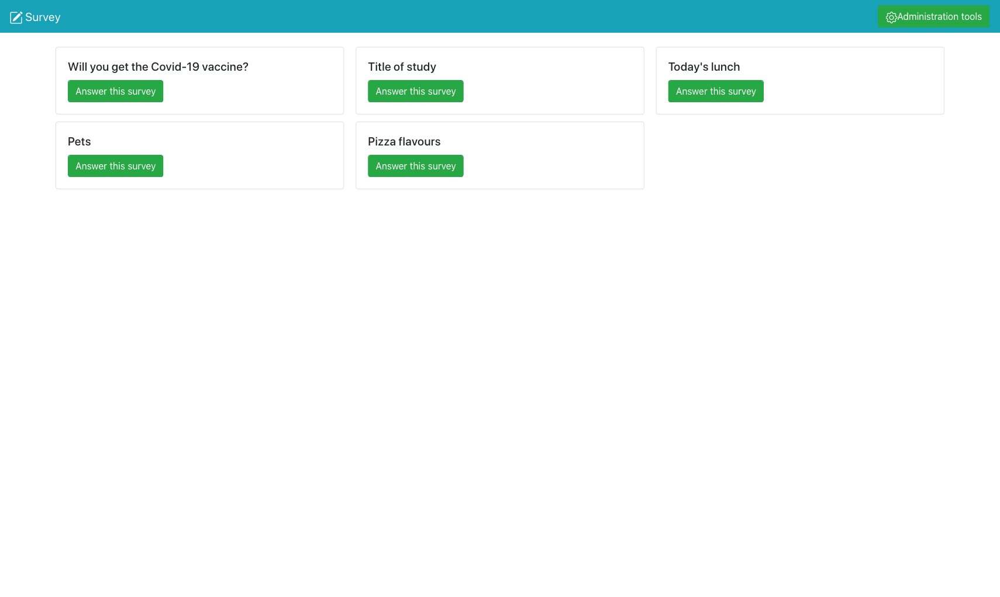
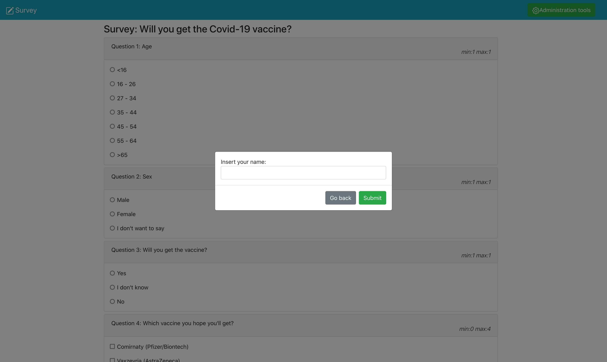
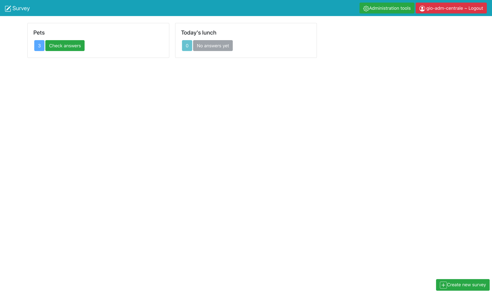
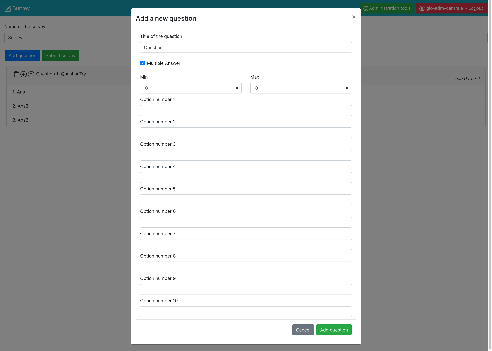
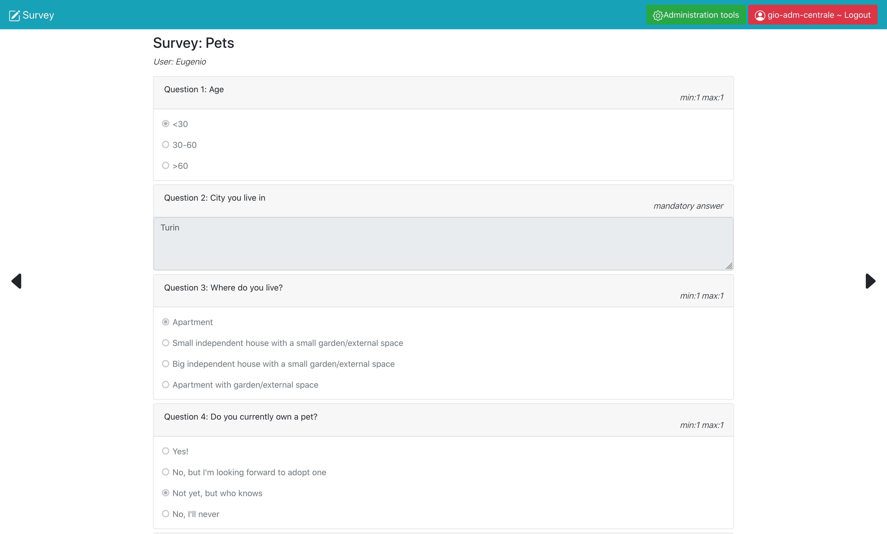

# Exam #1: "Surveys"

## Student: s281605 TAURINO ANDREA 

## React Client Application Routes

- Route _exact_ `/` : home page for users, here all published surveys are shown and the user can choose which survey to fill

- Route _exact_ `/answersurvey/:id ` : this page allows the user to fill and submit the survey selected in the home page.

  The `:id` parameter identifies the survey and it is used to retrieve the questions from the database (SurveyId field in answer table) 

- Route _exact_ `/adminpanel` : page for the administrators, here all the surveys published by a certain admin are shown with the number of received responses, there's also a button that allows to create a new survey. If #responses >0, the admin can choose a survey and check the answers given by each user.

- Route _exact_ `/adminpanel/newsurvey` : page where the admin can create a new survey with an indefinite number of questions whom can be deleted or moved up/down.

- Route exact `/viewanswers/:id/:ansid` : page where the admin can read all the answers given to survey by a user.

  `:id` identifies the survey (SurveyId on the DB) and `:ansid` is a sequential number that allows to move between the answers given by different users to the chosen survey. `:ansid` goes from 0 to `#answers-given-to-[:id]-survey - 1`

- Route `/` : this route is at the bottom of the list, and just redirects any address different from the ones described above (e.g. `/ran-dom-rou-te`) to `/`

All of these Routes, (except `/` and `/answersurvey/:id`) when the admin is not logged in, show a login interface.

## API Server

- POST `/api/survey` - saves a new survey in the DB
  - request body content: `{"nameSurvey": survName, "questionArray": [{"title" : survTitle, "isMultiple": isMultipleBoolean , "isOptional" : isOptionalBoolean, "multipleAnswers": [...] , "max": maxAnswers, "min" : minAnswers , "answerToQuestion" : []}, ...]}`
  
- POST `/api/answer` - stores the survey filled by the user in the DB

  - request body content: `{"username": nameOfUser,"id": surveyId , "survey" : {"questionArray":[{"answerToQuestion": answer}, ... , {"answerToQuestion": answer(s)}, ...] } }`

- GET `/api/survey/id/:id` - retrieves a survey by its SurveyId 

  - request parameters: SurveyId `:id`
  - response body content:  `{"nameSurvey": survName, "questionArray": [{"title" : survTitle, "isMultiple": boolean , "isOptional" : boolean, "multipleAnswers": [...] , "max": maxAnswers, "min" : minAnswers , "answerToQuestion" : [...]}, ...]}`

- GET `/api/survey/all` - retrieves all the surveys stored in the DB

  - response body content:  `[{"SurveyId": surveyId,"Questions":[{"nameSurvey": survName, "questionArray": [{"title" : survTitle, "isMultiple": boolean , "isOptional" : boolean, "multipleAnswers": [...] , "max": maxAnswers, "min" : minAnswers , "answerToQuestion" : [...]},  ...] } ]`

- GET `/api/survey/all/byadmin` - retrieves all the surveys published by a particular admin

  - response body content:  `[{"SurveyId": surveyId,"Questions":[{"nameSurvey": survName, "questionArray": [{"title" : survTitle, "isMultiple": boolean , "isOptional" : boolean, "multipleAnswers": [...] , "max": maxAnswers, "min" : minAnswers , "answerToQuestion" : [...]},  ...] } ]`

- GET `api/survey/countanswers` - returns, for each survey, the number of submissions by users 

  - response body content: `[{"SurveyId": surveyId,"NumRisposte": numAnswersToSurvey},{"SurveyId": surveyId,"NumRisposte": numAnswersToSurvey}, ...]`

- GET `/api/survey/answerids/:id` - retrieves all the AnswerIds for a specific survey 

  - request parameters: surveyId `:id`
  - response body content:  `[{"AnswerId":answerId},{"AnswerId":answerId}, ...]`

- GET `/api/answer/id/:id`  - retrieves the answers of the survey submitted by a user

  - request parameters: AnswerId `:id`
  - response body content:  `{"Username":nameOfUser,"Questions":{"questionArray":[{"answerToQuestion":answer(s)},{"answerToQuestion":answer(s)}, ...]}}`

  

## Database Tables

- Table `user` - contains **`id`**, `username`, `name`, `hash`
  - `id` uniquely identifies the admin, is the same as `AdminId` in the tables below
- Table `survey` - contains **`SurveyId`**, `AdminId`, `Questions`
  - `Questions` contains the JSON of the survey (title, array of questions and [empty] answers and other information such as: optional answer, multiple answer, max and min of selectable multiple answers)
- Table `answer` - contains **`AnswerId`**, `SurveyId`, `Username`
  - `Username` is the name of the user who filled the survey

## Main React Components

- `ViewAnswers` (in `AnswerView.js`) : this component shows the answers given by a user to a survey and helps switching across users' answers by the arrows at the side of the screen. 
  This component is also responsible for "merging" the answers object with the original answer-less survey object, the result is a survey object with all the answers given by the user.
  This new survey+answers object is visualized through the `ShowQuestions` component.
- `SurveyCards` (in `SurveyCardsComponent.js`) : this components, given the array that contains the surveys, for each survey returns the surveyName and the button that allows the user to answer the survey (by redirecting to the specific route).
  If it's called from `Surveys` in `SurveyManagement`, it also shows the number of answers for each survey and a button that allows to see the answers given by users (by redirecting to the specific route)
- `Surveys` (in `SurveysManagement.js`) : this component is called to offer a dashboard of the surveys' status of the admin. It relies on `SurveyCards` to whom passess all the necessary parameters in order to show the number of answers per survey. 
- `UserView` (`in UserComponent.js`) : this component calls `SurveyCards` in order to show all the available surveys and allow the user to answer.
- `ShowQuestions` (in `QuestionDisplayComponent.js`) : this component returns the list of questions contained in the survey object. When called from `AnswerToSurvey`, allows the user to fill the form in order to submit its answers. Otherwise, when called from `ViewAnswers` it shows the the survey with the answers but it doesn't allow any modification.
- `CreateSurvey` (in `CreateSurveyComponent.js`) : this component helps the admin to create a new survey. It performs the validity checks necessary in order to submit a logically valid survey, it show the list of questions inserted and allows to delete or move them (up/down). For the insertion of questions, relies on `QuestionForm`
- `QuestionForm` (in `CreateSurveyComponent.js`) : this componets is visualized inside a modal, allows to enter the title of the question and the various options (if the question is optional, the multiple-choice questions, the max number of choices...) and performs validity checks on the entered values
- `AnswerToSurvey` (in `AnswerSurvey.js`) : this component allows the user to answer the survey, by showing the questions and performing validity checks on the constraints defined in the survey (such as: min or max number of multiple choice questions and mandatory/optional answers) before submitting the filled survey. All the answers are written on the Survey object retrieved from the DB, this component, before submitting, cleans the object from unnecessary information in order to save only the answers in the DB.

## Screenshot

## Users Credentials

### Admin 1
- username: `pippo-adm-sud`
- password: `plutoishere`
- name: Pippo Papero 

#### Surveys
- Survey `1`: "Will you get the Covid-19 vaccine?"
- Survey `3`: "Title of study"
- Survey `4`: "Pizza flavours"

### Admin 2
- username: `gio-adm-centrale`
- password: `ravioli`
- name: Giovanni Rana 

#### Surveys
- Survey `2`: "Pets"

- Survey `5`: "Today's lunch"

### 
